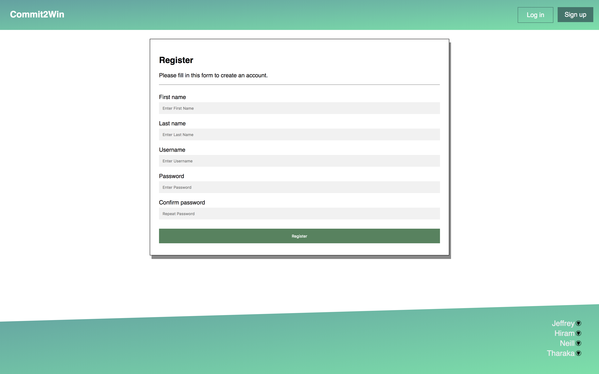
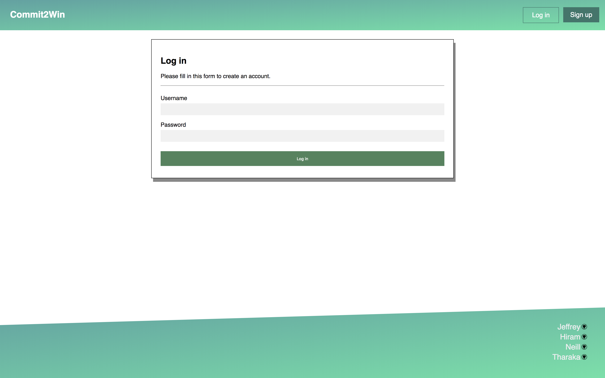
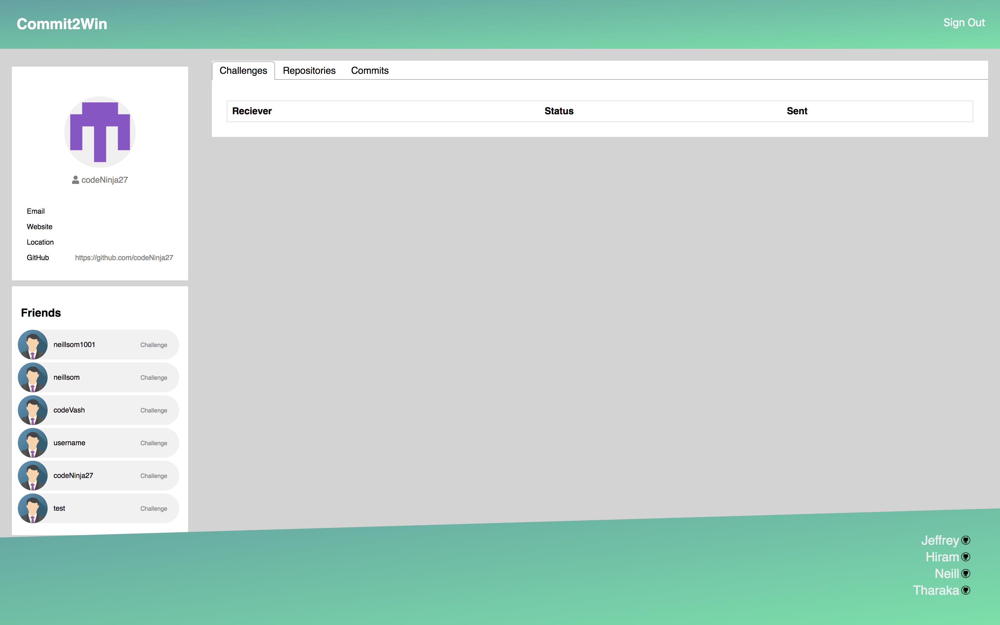

# Commit2Win

## Live
TODO: Insert live link

## Server Source
https://github.com/thinkful-ei20/ghub-tracker-server

## Description
Commit2Win is a web app created with the goal of using competition to encourage better version control usage. By tracking Github contributions, it allows users to compete with each other on a day-to-day basis. Users are further encouraged to compete with a challenge system that allows a user to directly compare their contributions with another.

## Screenshots

Home  

Register  

Login  

Challenges  

Commits  

## Technologies

- React
- Redux
- Redux-Thunk
- Redux-Form
- react-easy-chart
- fontawesome